# Diagrama Entidad-Relación – Portal Digital IGSS  
## Dimensionamiento de la aplicación (trabajo de graduación)

Este documento detalla lo que lleva inmerso la aplicación del Portal Digital IGSS mediante su **modelo de datos** (diagrama ER y descripción de entidades y relaciones).

---

## 1. Descripción de entidades y atributos

### 1.1 Usuarios y seguridad

| Entidad | Tabla BD | Descripción | Atributos principales |
|--------|----------|-------------|------------------------|
| **User** | `user` | Usuario del sistema (empleado IGSS) | id, nombres, apellidos, dpi, nit, telefono, correoInstitucional, codigoEmpleado, renglon, unidadMedica, puestoId (FK), departamento_direccion_id (FK), departamento_direccion (texto) |
| **Credential** | `credential` | Credencial de acceso (contraseña) | id, codigoEmpleado, password (hash), isTempPassword, userId (FK → User) |
| **Role** | `role` | Rol del usuario (ej. Analista DAF, Compras) | id, name |
| **Permission** | `permission` | Permiso granular (ej. crear-siaf, revisar-siaf-direccion-departamental) | id, name, description |

**Tablas de unión N:M**

- **user_roles:** userId ↔ roleId (un usuario tiene varios roles).
- **role_permissions:** roleId ↔ permissionId (un rol tiene varios permisos).

### 1.2 Organización y catálogos geográficos

| Entidad | Tabla BD | Descripción | Atributos principales |
|--------|----------|-------------|------------------------|
| **Puesto** | `puesto` | Puesto de trabajo (ej. Jefe de Compras) | id, nombre, activo |
| **Area** | `areas` | Área o departamento interno (ej. Compras) | id, nombre, descripcion, activo, createdAt, updatedAt |
| **Departamento** | `departamentos` | Departamento geográfico (ej. Escuintla) | id, nombre |
| **Municipio** | `municipios` | Municipio del departamento | id, nombre, departamento_id (FK → Departamento) |
| **UnidadMedica** | `unidad_medica` | Consultorio o unidad (ej. Palín) | id, nombre, departamento (texto), municipio_id (FK → Municipio), telefonos |

### 1.3 SIAF (solicitudes de compra)

| Entidad | Tabla BD | Descripción | Atributos principales |
|--------|----------|-------------|------------------------|
| **SiafSolicitud** | `siaf_solicitudes` | Solicitud SIAF (núcleo del flujo) | id, correlativo (único), fecha, usuario_solicitante_id (FK), nombreUnidad, direccion, area_id (FK), justificacion, nombreSolicitante, puestoSolicitante, unidadSolicitante, nombreAutoridad, usuario_autoridad_id (FK), usuario_encargado_id (FK), puestoAutoridad, unidadAutoridad, consistenteItem, estado (pendiente/autorizado/rechazado), aprobadoDireccionDepartamental, pdfPath, pdfHash, pdfSize, created_at, updated_at |
| **SiafItem** | `siaf_items` | Ítem o línea de bien/producto en el SIAF | id, siaf_id (FK), codigo, descripcion, cantidad, orden |
| **SiafSubproducto** | `siaf_subproductos` | Subproducto o detalle adicional por ítem | id, siaf_id (FK), codigo, cantidad, orden |
| **SiafAutorizacion** | `siaf_autorizaciones` | Registro de autorización o rechazo (unidad + DAF) | id, siaf_id (FK), usuario_autorizador_id (FK), accion (autorizado/rechazado), comentario, motivo_rechazo, fecha_autorizacion |
| **SiafBitacora** | `siaf_bitacora` | Bitácora de cambios (rechazo, corrección, aprobado) | id, siaf_id (FK), tipo (rechazo/correccion/autorizado/aprobado_dd), usuario_id (FK), comentario, detalle_antes, detalle_despues, fecha |
| **SiafDocumentoAdjunto** | `siaf_documentos_adjuntos` | Documentos adjuntos al SIAF (especificaciones, AS-400, etc.) | id, siaf_id (FK), nombreOriginal, rutaArchivo, mimeType, tamanioBytes, hashArchivo, fecha_subida |

### 1.4 Expedientes

| Entidad | Tabla BD | Descripción | Atributos principales |
|--------|----------|-------------|------------------------|
| **Expediente** | `expedientes` | Expediente que agrupa documentos (post aprobación SIAF) | id, numeroExpediente (único), usuario_id (FK), tipoExpediente, titulo, descripcion, estado (abierto/en_proceso/cerrado/archivado), fechaApertura, fechaCierre, created_at, updated_at |
| **ExpedienteDocumento** | `expediente_documentos` | Documento dentro del expediente (SIAF, orden compra, factura, etc.) | id, expediente_id (FK), tipoDocumento, nombreArchivo, rutaArchivo, mimeType, tamanioBytes, hashArchivo, subido_por (FK), descripcion, fecha_subida |

### 1.5 Catálogo de productos

| Entidad | Tabla BD | Descripción | Atributos principales |
|--------|----------|-------------|------------------------|
| **ProductoCatalogo** | `producto_catalogo` | Catálogo de códigos de productos/bienes para el SIAF | id, codigo, descripcion, createdAt |

---

## 2. Relaciones entre entidades

| Desde | Hacia | Tipo | Descripción |
|-------|--------|------|-------------|
| User | Puesto | N:1 | Un usuario tiene un puesto (opcional). |
| User | Departamento | N:1 | Un usuario puede estar asignado a Dirección Departamental (opcional). |
| User | Role | N:M (user_roles) | Un usuario puede tener varios roles. |
| Role | Permission | N:M (role_permissions) | Un rol tiene varios permisos. |
| Credential | User | 1:1 | Una credencial pertenece a un usuario. |
| SiafSolicitud | User | N:1 (x3) | Solicitante, autoridad y encargado. |
| SiafSolicitud | Area | N:1 | Área que solicita. |
| SiafItem, SiafSubproducto | SiafSolicitud | N:1 | Ítems y subproductos pertenecen a una solicitud SIAF. |
| SiafAutorizacion, SiafBitacora, SiafDocumentoAdjunto | SiafSolicitud | N:1 | Autorizaciones, bitácora y adjuntos pertenecen a una solicitud SIAF. |
| SiafAutorizacion, SiafBitacora | User | N:1 | Usuario que autoriza o registra en bitácora. |
| Municipio | Departamento | N:1 | Municipio pertenece a un departamento. |
| UnidadMedica | Municipio | N:1 | Unidad médica pertenece a un municipio. |
| Expediente | User | N:1 | Usuario responsable del expediente. |
| ExpedienteDocumento | Expediente | N:1 | Documento pertenece a un expediente. |
| ExpedienteDocumento | User | N:1 | Usuario que subió el documento. |

---

## 3. Diagrama ER (Mermaid)

Para visualizar en GitHub, VS Code (con extensión Mermaid) o en [mermaid.live](https://mermaid.live):

```mermaid
erDiagram
    user ||--o| credential : "tiene"
    user }o--o{ role : "user_roles"
    role }o--o{ permission : "role_permissions"
    user }o--o| puesto : "puestoId"
    user }o--o| departamentos : "departamento_direccion_id"
    departamentos ||--o{ municipios : "tiene"
    unidad_medica }o--o| municipios : "municipio_id"
    areas ||--o{ siaf_solicitudes : "area_id"
    user ||--o{ siaf_solicitudes : "usuario_solicitante_id"
    user ||--o{ siaf_solicitudes : "usuario_autoridad_id"
    user ||--o{ siaf_solicitudes : "usuario_encargado_id"
    siaf_solicitudes ||--o{ siaf_items : "tiene"
    siaf_solicitudes ||--o{ siaf_subproductos : "tiene"
    siaf_solicitudes ||--o{ siaf_autorizaciones : "tiene"
    siaf_solicitudes ||--o{ siaf_bitacora : "tiene"
    siaf_solicitudes ||--o{ siaf_documentos_adjuntos : "tiene"
    user ||--o{ siaf_autorizaciones : "usuario_autorizador_id"
    user ||--o{ siaf_bitacora : "usuario_id"
    user ||--o{ expedientes : "usuario_id"
    expedientes ||--o{ expediente_documentos : "tiene"
    user ||--o{ expediente_documentos : "subido_por"

    user {
        int id PK
        string nombres
        string apellidos
        string dpi
        string codigoEmpleado
        string unidadMedica
        int puestoId FK
        int departamento_direccion_id FK
    }
    credential {
        int id PK
        string codigoEmpleado
        string password
        int userId FK
    }
    role {
        int id PK
        string name
    }
    permission {
        int id PK
        string name
    }
    puesto {
        int id PK
        string nombre
    }
    areas {
        int id PK
        string nombre
    }
    departamentos {
        int id PK
        string nombre
    }
    municipios {
        int id PK
        string nombre
        int departamento_id FK
    }
    unidad_medica {
        int id PK
        string nombre
        int municipio_id FK
    }
    siaf_solicitudes {
        int id PK
        string correlativo
        date fecha
        int usuario_solicitante_id FK
        int area_id FK
        string estado
        boolean aprobado_direccion_departamental
        string pdfPath
    }
    siaf_items {
        int id PK
        int siaf_id FK
        string codigo
        string descripcion
        int cantidad
    }
    siaf_subproductos {
        int id PK
        int siaf_id FK
        string codigo
        int cantidad
    }
    siaf_autorizaciones {
        int id PK
        int siaf_id FK
        int usuario_autorizador_id FK
        string accion
        string motivo_rechazo
    }
    siaf_bitacora {
        int id PK
        int siaf_id FK
        int usuario_id FK
        string tipo
        text comentario
    }
    siaf_documentos_adjuntos {
        int id PK
        int siaf_id FK
        string nombreOriginal
        string rutaArchivo
    }
    expedientes {
        int id PK
        string numeroExpediente
        int usuario_id FK
        string tipoExpediente
        string estado
    }
    expediente_documentos {
        int id PK
        int expediente_id FK
        string tipoDocumento
        string nombreArchivo
        int subido_por FK
    }
    producto_catalogo {
        int id PK
        string codigo
        string descripcion
    }
```

---

## 4. Resumen: qué lleva inmerso la aplicación

El Portal Digital IGSS incluye:

1. **Seguridad y organización:** usuarios, credenciales, roles, permisos, puestos, áreas, departamentos, municipios y unidades médicas.
2. **Núcleo SIAF:** solicitud SIAF con ítems y subproductos; autorizaciones (unidad y DAF); bitácora de rechazos/correcciones/aprobaciones; documentos adjuntos (especificaciones, AS-400); generación y almacenamiento de PDF.
3. **Expedientes:** expediente digital con documentos cargados (SIAF aprobado, órdenes de compra, facturas, etc.) y trazabilidad de quién subió cada documento.
4. **Catálogo:** productos/bienes para el llenado correcto del SIAF (consulta e importación).

Con este diagrama ER se detalla lo que lleva inmerso la aplicación y se dimensiona el tamaño del trabajo de graduación a nivel de datos y relaciones.
