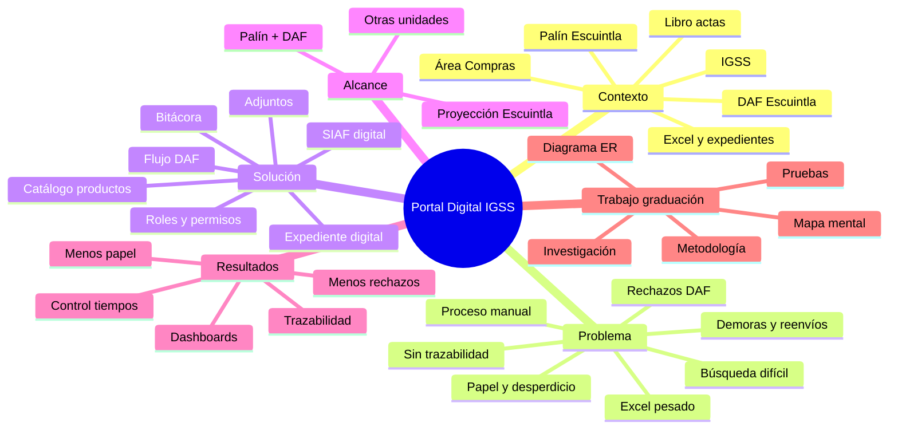

# Mapa mental – Portal Digital IGSS  
## Idea principal y temas conexos (trabajo de graduación)

Técnica: **mapa mental** con idea central y ramas de temas conexos.

---

## 1. Representación en texto (estructura del mapa mental)

```
                    PORTAL DIGITAL IGSS
                  (Trabajo de graduación)
                            |
    ________________________|________________________
    |           |           |           |           |
 CONTEXTO   PROBLEMA    SOLUCIÓN    ALCANCE    RESULTADOS
    |           |           |           |           |
    |           |           |           |           |
 IGSS        Proceso     SIAF        Palín +    Menos papel
 Palín       manual      digital     DAF        Menos rechazos
 Escuintla   Excel       Expediente  Escuintla  Trazabilidad
 Área        pesado      digital     Proyección Dashboards
 Compras     Papel       Bitácora    otras      Tiempos
 DAF         Rechazos    Aprobación   unidades   control
 Escuintla   DAF         Rechazo
             Demoras     Analista
             Libro       Rol DAF
             actas       Adjuntos
                         Especificaciones
                         AS-400
```

---

## 2. Ramas del mapa mental (temas conexos)

### Rama 1: CONTEXTO INSTITUCIONAL Y ÁREA DE ESTUDIO

- IGSS (Instituto Guatemalteco de Seguridad Social).
- Consultorio de Palín, Escuintla.
- Área de Compras (bienes y servicios).
- DAF (Dirección de Administración Financiera) departamental – Escuintla.
- Libro de actas para números SIAF.
- Formatos Excel con catálogo de códigos.
- Expedientes físicos y envío a DAF.

### Rama 2: PROBLEMA Y DEFICIENCIAS

- Trabajo 100% manual en documentos y Excel.
- Formatos Excel muy pesados y lentos.
- Alto consumo y desperdicio de papel por correcciones.
- Dificultad para buscar SIAF dentro del mismo libro.
- Rechazos frecuentes en DAF (ortografía, redacción, comparación AS-400 vs SIAF).
- Demora en revisión (todos los municipios del departamento).
- Devolución de expedientes completos para corregir y reimprimir.
- Falta de trazabilidad clara de aprobaciones y rechazos.

### Rama 3: SOLUCIÓN TECNOLÓGICA (PORTAL)

- **SIAF digital:** formulario en línea, sin Excel pesado.
- **Documentos adjuntos:** especificaciones técnicas, AS-400, etc., desde el inicio.
- **Flujo DAF:** envío a analista; aprobar o rechazar con motivo.
- **Bitácora:** registro de aprobaciones, rechazos y correcciones.
- **Expediente digital:** carga de todos los documentos del expediente (incluidos de GuateCompras/otros); nueva revisión por analista.
- **Comparación de versiones:** ver documento original vs corregido en rechazos.
- **Roles y permisos:** solicitante, autoridad, encargado, analista DAF.
- **Catálogo de productos:** consulta e importación para llenado correcto del SIAF.

### Rama 4: ALCANCE Y PROYECCIÓN

- **Fase inicial:** Consultorio Palín (Compras) + DAF Escuintla.
- **Proyección:** Otras unidades del departamento de Escuintla.
- **Futuro:** Posible extensión a otros departamentos.
- **Límite:** No reemplaza GuateCompras ni otros sistemas; integra por carga de documentos.

### Rama 5: RESULTADOS Y BENEFICIOS ESPERADOS

- Reducción de papel y reimpresiones.
- Menos rechazos por errores detectables antes de enviar (validaciones, adjuntos completos).
- Trazabilidad (bitácora) de quién aprobó/rechazó y cuándo.
- Dashboards: rechazos por usuario, tiempos de evaluación, tiempo hasta aprobación.
- Identificación de cuellos de botella.
- Expediente completo visible para el analista en un solo lugar.
- SIAF correcto como base antes de armar el resto del expediente.

### Rama 6: FUNDAMENTOS DEL TRABAJO DE GRADUACIÓN

- Investigación preliminar (contexto, viabilidad).
- Mapa mental (esta rama: idea central y temas conexos).
- Diagrama Entidad-Relación (dimensionamiento de la aplicación).
- Metodología de desarrollo (backend, frontend, BD).
- Gestión documental y flujos de aprobación.
- Seguridad (autenticación, roles, permisos).
- Pruebas y validación con usuarios tipo Palín y DAF.

---

## 3. Diagrama del mapa mental (Mermaid)

Para visualizar en un visor que soporte Mermaid (p. ej. GitHub, VS Code con extensión Mermaid):



---

## 4. Resumen para entrega

- **Idea central:** Portal Digital IGSS como solución para digitalizar el SIAF y el flujo de revisión con la DAF, reducir papel y rechazos, y dar trazabilidad y métricas.
- **Temas conexos:** contexto (IGSS, Palín, DAF), problema (manual, Excel, rechazos, demoras), solución (SIAF digital, expediente, bitácora, roles), alcance (Palín, DAF, proyección) y resultados (papel, rechazos, dashboards), más los fundamentos del trabajo de graduación (investigación, mapa mental, diagrama ER, metodología).

Este mapa mental dimensiona los ejes del trabajo de graduación y sus temas conexos de acuerdo con la técnica del mapa mental.
